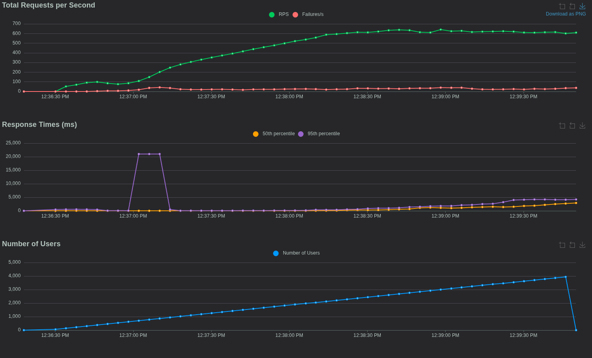

# WeatherIO — Асинхронный погодный сервис
REST API сервис на базе FastAPI для отслеживания прогноза погоды через Open-Meteo API.

## Запуск приложения

### 1. Подготовка

Убедитесь, что у вас установлен **Python 3.10+**.

#### Linux

```bash
python3 -m venv venv
source venv/bin/activate
pip install -r requirements.txt
```

#### Windows

```powershell
python -m venv venv
.\venv\Scripts\activate
pip install -r requirements.txt

```

### 2. Запуск сервера

```bash
python script.py
```

После запуска документация Swagger будет доступна по адресу: `http://127.0.0.1:8000/docs`

Подробно API описывать здесь не буду, смотрите доки.

Список доступных методов:

* **`GET /weather/current`**
* **`GET /weather/city/{name}`**
* **`POST /users`**
* **`POST /cities`**
* **`GET /cities`**

---

## Запуск тестов

Для тестирования используется `pytest` с плагином `pytest-asyncio`.

```bash
#Запуск тестов
pytest tests.py

```


## Описание процесса разработки и решений архитектуры.

Разработка велась по принципу **TDD (Test-Driven Development)** в несколько этапов:

1. **Анализ и требований**: Анализ требований, выявление неточностей и неописанных аспектов, решения по стеку, базе данных.
2. **Набросок программы**: Обозначены сигнатуры классов и функций.
3. **Написание тестов**: Описаны несколько простых сценариев как для используемых репозиториев, так и api.
4. **Реализация проекта**: Реализация описанных функций и классов.
5. **Багфиксы, дополнение тест кейсов**
6. **Нагрузочное тестирование**

В приложении use-cases перенесены непосредственно в методы API, классы Repo представляю из себя слои и репозиториев, и сервисов одновременно. Логика доменных моделей, соответсвенно, тоже находится в них.
Можно было написать всё с красивыми абстракциями и надлежащим образом разбить приложение по слоям, но мне приложение показалось слишком маленьким и не имеющим продолжения, чтобы об этом заботиться. Если хотите посмотреть на похожее приложение на чистой архитектуре, можете заглянуть в другой мой репозиторий https://github.com/inoutlake/toolrecognize_backend .
На разработку было затрачено всего ~12 часов, более подробно процесс разработки и размышлений можно посмотреть в [TODO.md](TODO.md) и истории коммитов.

## Результаты:




Анализ результатов:
- Я удовлетворился тем, что увидел при 4 воркерах и не стал пушить систему дальше. Рано или поздно система упрется в I/O операции, соответственно скейлить можно будет только аппаратно, покупая более быстрые ssd. Один воркер смог обрабатывать ~250 запросов, но этот предел вполне можно преодолеть, сняв ограничение на количество открытых сокетов на процесс в linux.
- Система быстро Система быстро упирается в ограничение на RPH на Open Meteo. Это можно поправить добавив кэширование на роут `weather/current`.

---

## Проблемы и принятые решения

В ходе реализации возник ряд вопросов из-за неточностей в требованиях. Ниже приведены принятые решения:

### 1. Интерпретация "Текущего дня" и Времени

**Проблема**: Требование запрашивать погоду по параметру `time` (без даты) неоднозначно в контексте разных часовых поясов.
**Решение**:

* Сервер хранит все данные прогнозов с указанием локального для координат времени. Хранятся почасовые данные. `Текущим днем` считаются следующие 24 часа.
* При запросе прогноза на конкретное время (например, `14:15`), сервис отправляет данные по местному для запрошенной локации времени. Выбираются данные наиболее близкие по времени к сохраненным данным. 

### 2. Пользовательская система

**Проблема**: В задании указано, что методы 2, 3 и 4 должны принимать ID пользователя, но погодные данные одинаковы для всех пользователей. В требованиях не описано, каким именно образом информация пользователя может повлиять на предоставляемые данные. Чисто теоретически можно было сделать что-то вроде системы доступа к данным, но она была бы нелогичной.
**Решение**: Реализована система связей "многие-ко-многим". Город сохраняется в БД один раз, но привязывается к конкретным пользователям. Метод получения списка городов (`GET /cities`) фильтрует выдачу по `user_id`, если он передан. Больше никаких фильтров по user_id нет. Города можно добавлять и без user_id, они будут функционировать так же, как и другие.
